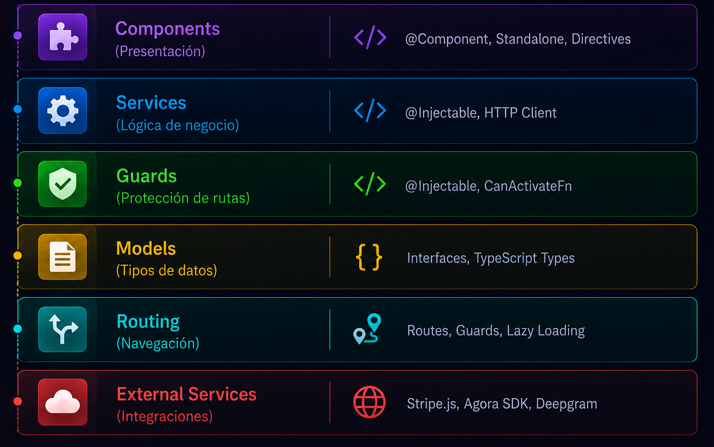
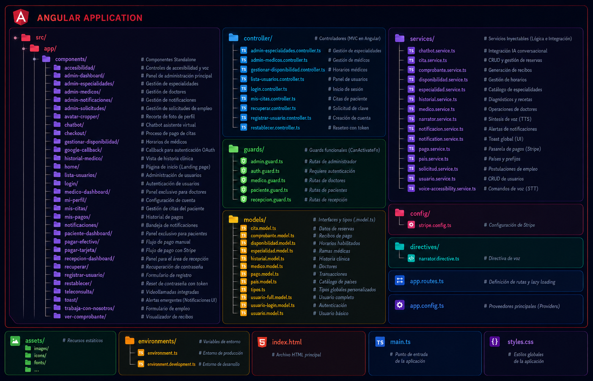

# RETO SALUD - Frontend (Angular)

<div align="center">
  <picture>
    <source media="(prefers-color-scheme: dark)" srcset="../assets/RETO%20SALUD%20FRONTEND-blanco.png">
    <source media="(prefers-color-scheme: light)" srcset="../assets/RETO%20SALUD%20FRONTEND.png">
    
  </picture>
</div>

El frontend de **RETO SALUD** es una Single Page Application (SPA) desarrollada en Angular, enfocada en brindar una experiencia fluida, accesible y segura tanto para pacientes como para personal médico y administrativo de la clínica.

## Arquitectura del Frontend

<div align="center">
  
</div>

## Stack Tecnológico

| Componente | Tecnología | Versión | Decoradores Principales |
|------------|------------|---------|-------------------------|
| **Framework** | Angular | 17+ | `@Component`, `@Injectable` |
| **Reactive** | RxJS | 7.x | `Observable`, `Subject`, `BehaviorSubject` |
| **HTTP** | Angular HTTP | 17+ | `HttpClient`, `HttpInterceptorFn` |
| **Routing** | Angular Router | 17+ | `Routes`, `CanActivateFn` |
| **Videollamadas** | Agora SDK Web | 4.x | Conexión P2P en `teleconsulta` |
| **Accesibilidad** | Deepgram | V1 | WebSockets, Transcripción Voz a Texto |
| **Pagos** | Stripe.js | 3.x | `StripeElements`, `PaymentIntent` |
| **Mapas** | Leaflet | 1.x | `L.map`, `L.tileLayer` |

## Prerrequisitos

- Node.js 18 o superior
- Angular CLI 17 o superior
- npm 9 o superior

## Instalación

### 1. Clonar e instalar dependencias

```bash
cd Frontend
npm install
```

### 2. Configuración del Entorno

Navega a `src/environments/` y edita `environment.ts` o `environment.development.ts`:

```typescript
export const environment = {
  production: false,
  apiUrl: 'http://localhost:8080/api/v1',
  stripePublicKey: 'pk_test_tu_clave_publica_stripe'
};
```

### 3. Ejecutar en desarrollo

```bash
ng serve -o
```

La aplicación se abrirá automáticamente y estará disponible en: `http://localhost:4200`

## Estructura del Proyecto

<div align="center">
  
</div>

## Características Especiales de Accesibilidad ♿
La aplicación cuenta con características avanzadas de accesibilidad impulsadas por IA:
- **Navegación por Voz:** Los pacientes pueden navegar por la plataforma, agendar citas, moverse por los menús y rellenar formularios hablando directamente al micrófono.
- **Subtítulos en Vivo:** Durante la teleconsulta, la voz se transcribirá en tiempo real (estilo Google Meet) en la pantalla para personas con discapacidad auditiva.
